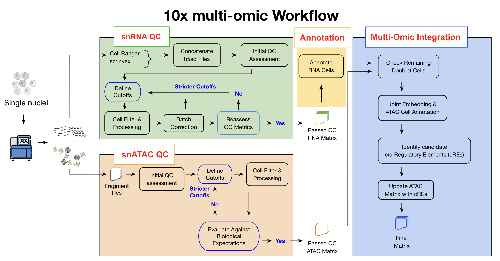

# Pan-tissue scMultiome pipeline

## What This Repository Does

A pipeline for processing single-cell multiome data (paired snRNA-seq +
snATAC-seq, e.g. 10x Multiome) from CellRanger/fragment-file output through
per-modality QC, cell annotation, and joint RNA+ATAC integration.

This repo covers data preprocessing only. Downstream analysis for the
manuscript (cCRE calling, chromatin domain mapping, cancer remodelling,
variant-effect models) lives in the companion repo:
[human-adult-cross-tissue-scmultiome-analysis](https://github.com/KailiBio/human-adult-cross-tissue-scmultiome-analysis).

## Table of Contents
- [What This Repository Does](#what-this-repository-does)
- [Overview](#overview)
- [Installation](#installation)
- [The Four Modules](#the-four-modules)
- [Running the Demo](#running-the-demo)
- [Setting Up Your Own Data](#setting-up-your-own-data)
- [Directory Structure](#directory-structure)
- [Troubleshooting](#troubleshooting)
- [Citation](#citation)
- [Contact](#contact)

---



## Overview

The workflow is organized into four self-contained modules, meant to be run
in sequence. Each module has its own config, scripts, notebook, and demo
data, so it can also be run and adapted on its own:

```
RNA_QC  ──┐
          ├──> cell_annotation ──┐
ATAC_QC ──┴──────────────────────┴──> multiome_integration
```

1. **[`RNA_QC/`](RNA_QC/)** — QC and filtering for snRNA-seq: CellRanger
   metric checks, per-tissue concatenation, MAD-based QC filtering, doublet
   detection, and clustering.
2. **[`ATAC_QC/`](ATAC_QC/)** — QC and filtering for snATAC-seq: PCR-chimera
   removal, fragment-to-AnnData loading (via `snapatac2`), KDE-based cell
   filtering, doublet detection, and clustering.
3. **[`cell_annotation/`](cell_annotation/)** — Takes RNA_QC output,
   identifies marker-gene-based clusters, and runs automatic cell-type
   annotation (via [ScType](https://github.com/kris-nader/sc-type-py)).
4. **[`multiome_integration/`](multiome_integration/)** — Joins the RNA and
   ATAC modalities per barcode, integrates them (GLUE, MultiVI), imputes
   cross-modality signal, and produces the final annotated multiome AnnData
   objects.

Each module folder has its own `README.md` with details specific to that
step (required inputs, config fields, pipeline order, outputs).

## Installation

```bash
git clone https://github.com/KailiBio/Multiomic-workflow.git
cd Multiomic-workflow
pip install -r requirements.txt
```

Requires Python ≥ 3.8. `requirements.txt` covers `scanpy`, `anndata`,
`snapatac2`, `harmonypy`, `upsetplot`, `scikit-image`, `igraph`, `jupyter`,
and other core dependencies. Note `snapatac2` (ATAC_QC) and MultiVI/GLUE
(multiome_integration, via `scvi-tools`/`scglue`) can have their own
platform-specific install requirements (e.g. a compatible PyTorch build) —
consult those projects' docs if `pip install -r requirements.txt` fails on
them.

## The Four Modules

| Module | Input | Output |
|---|---|---|
| `RNA_QC` | CellRanger `filtered_feature_bc_matrix.h5` + `metrics_summary.csv` per sample | Filtered, QC'd, clustered RNA `.h5ad` |
| `ATAC_QC` | Per-sample fragment files (`fragments.tsv.gz`) | Filtered, QC'd, clustered ATAC `.h5ad` |
| `cell_annotation` | `RNA_QC` output `.h5ad` + a marker-gene table | Annotated RNA `.h5ad` with per-cluster cell-type calls |
| `multiome_integration` | `cell_annotation` + `ATAC_QC` (+ `RNA_QC` doublet info) output | Joint RNA+ATAC `.h5ad`, split RNA-only/ATAC-only views |

Every module reads a single YAML config (`<module>/config/*.yaml`) that
specifies input/output paths, the tissue(s) to process, and plotting
colors. See each module's README for its config's exact fields.

## Running the Demo

Every module ships with small demo data under its own `test_data/`, so you
can run each step end-to-end before pointing it at your own data. From the
repo root:

```bash
cd RNA_QC && bash notebooks/run_rna_qc_workflow.sh
cd ../ATAC_QC && bash notebooks/run_atac_qc_workflow.sh
cd ../cell_annotation && jupyter notebook notebooks/cell_annotation_demo.ipynb
cd ../multiome_integration && bash notebooks/run_multiome_integration_workflow.sh
```

(`cell_annotation` doesn't currently have a shell runner — run it via its
notebook, or call `scripts/annotate_cells.py` then
`scripts/generate_final_h5ad.py` directly with its config.) Each demo shell
script `cd`s into its own module directory and runs the module's scripts in
order against its bundled config and demo data; see the step-by-step list in
each module's README.

Every notebook under `*/notebooks/*_demo.ipynb` also walks through the same
steps interactively, with more explanation and intermediate inspection.

## Setting Up Your Own Data

1. **Input data.** For RNA_QC, create one directory per sample under your
   input dir (path set in `RNA_QC/config/rna_qc_config.yaml`):
   ```
   input_data/
     └── <rnaID>/
           ├── filtered_feature_bc_matrix.h5
           └── metrics_summary.csv
   ```
   For ATAC_QC, point `fragment_dir` at one directory per sample containing
   `fragments.tsv.gz` (or the PCR-chimera-cleaned equivalent).

2. **Sample metadata table.** A tab-separated table (no header) with columns
   `rnaID, atacID, species, donorID, ageGroup, gender, tissue` — see
   `ATAC_QC/test_data/test_metatable.txt` for the format. All four modules
   reference this same table.

3. **QC cutoff tables.** RNA_QC and ATAC_QC each take an Excel/TSV cutoff
   table (per-sample thresholds for cell filtering) — see
   `RNA_QC/test_data/test_QC_cutoffs.xlsx` / `ATAC_QC/test_data/test_QC_cutoffs.xlsx`
   for the expected columns.

4. **Config file.** Copy the relevant `config/*.yaml`, update `paths:` to
   point at your data, and set `params.tissue` (use `"---"` to process every
   tissue in the metadata table, or a single tissue name to run just one).
   Config paths are relative to that module's own directory by convention
   (see the comment at the top of each config file) — replace with your own
   paths, relative or absolute.

## Directory Structure

Each module follows the same layout:
```
<module>/
├── config/<module>_config.yaml   # paths, tissue(s), colors
├── scripts/                      # pipeline steps, run in order
├── <module_package>/             # shared plotting/utility code (utils.py, *_plots.py)
├── notebooks/                    # demo notebook + shell runner
├── test_data/                    # small bundled demo inputs
└── test_output/                  # demo run outputs (regenerated by running the demo)
```

## Troubleshooting

- **Missing package errors** (`upsetplot`, `igraph`, `scikit-image`,
  `harmonypy`, `snapatac2`, ...): install explicitly, see
  [Installation](#installation).
- **Config/path errors**: scripts validate required config keys up front and
  raise a clear error naming the missing key and config file — double-check
  the named key and any sample IDs/paths in your metadata and cutoff tables.
- **Reference files**: the GENCODE GTF and chromosome-sizes file are not
  shipped in this repo (too large) — see the comments in
  `ATAC_QC/config/atac_qc_config.yaml` and
  `multiome_integration/config/joint_multiomic_config.yaml` for what to
  supply.

## Citation
If you use this code, please cite:

> Fan et al. *Single-Nucleus Multi-Omic Atlas Maps Regulatory Architecture and
> Non-Coding Variant Effects across Adult Human Tissues*.
> bioRxiv https://doi.org/10.64898/2026.09.25.754561

## Contact

For help, bug reports, or feature requests, please
[open an issue](https://github.com/KailiBio/Multiomic-workflow/issues) on
GitHub.
